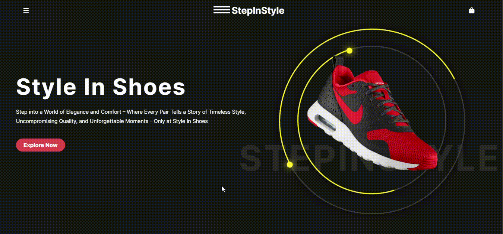

# ShoeAnimate

<h2>Shoe Site Animation Project</h2>

This project is created with HTML, CSS. It is an example of shoe site landing page. It shows the landing page of shoes website. I created some animations with pure CSS.

<h2>Technologies</h2>

-HTML -HTML5 -CSS -CSS3 -FontAwesome

<h2>Project Gif</h2>

You can see the project from this link: https://shoeanimate-css.netlify.app/